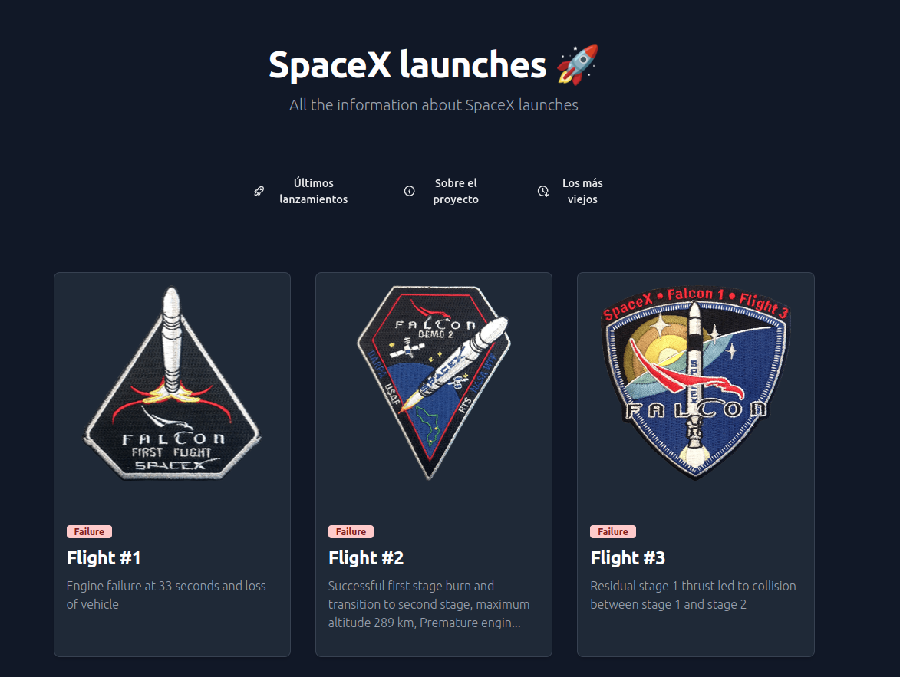

# Proyecto SpaceX Launch Viewer

Este proyecto tiene como objetivo proporcionar una interfaz de usuario para visualizar los lanzamientos de SpaceX. Proporciona información detallada sobre cada lanzamiento, incluyendo la fecha, misión, cohete utilizado y más.

## Características

- Visualización de los próximos lanzamientos de SpaceX.
- Detalles completos de cada lanzamiento, incluyendo la misión, fecha, cohete y más.
- Información sobre los cohetes utilizados por SpaceX.
- Galería de imágenes de los lanzamientos anteriores.

## Instalación

1. Clona este repositorio en tu máquina local.
2. Navega hasta el directorio del proyecto: `cd practicing-with-astro`.
3. Instala las dependencias del proyecto: `pnpm install`.
4. Inicia la aplicación: `pnpm run dev`.

## Uso

Una vez que la aplicación esté en funcionamiento, podrás ver los próximos lanzamientos de SpaceX en la página principal. Haz clic en cada lanzamiento para obtener más detalles. También puedes explorar la galería de imágenes de los lanzamientos anteriores.

## Captura de pantalla

Aquí puedes ver una captura de pantalla de la visualización inicial de la página:

Esta imagen muestra cómo se ve la página principal al cargarla por primera vez. Proporciona una vista general de los próximos lanzamientos de SpaceX y permite a los usuarios hacer clic en cada lanzamiento para obtener más detalles.

Espero que esta captura de pantalla te dé una idea de cómo se verá la página cuando la ejecutes en tu máquina local.
